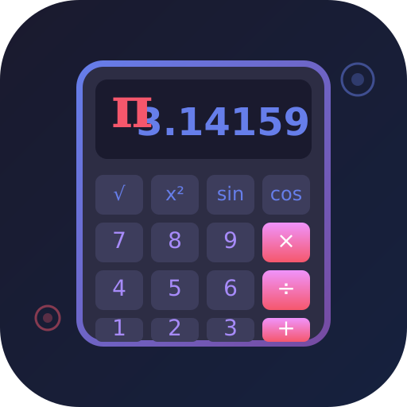

<p align="center">
  
</p>

<h1 align="center">🧮 Scientific Calculator</h1>

<p align="center">
  Kalkulator ilmiah canggih untuk Android — dual mode, dukungan dwibahasa, dan Material Design 3.
</p>

<p align="center">
  <a href="https://github.com/lunarcadedigital/scientific-calculator/releases">
    
  </a>
</p>

<p align="center">
  
  
  
  
</p>

---

## ⚠️ Disclaimer

> Aplikasi ini dibuat untuk tujuan **edukasi dan pembelajaran**. Cocok untuk pelajar, insinyur, dan siapa saja yang membutuhkan alat hitung canggih dan andal.

## ✨ Features

| Feature | Description |
|---------|-------------|
| 🔢 Dual Mode | Kalkulator Basic & Scientific dalam satu aplikasi |
| 🔬 Scientific Functions | Trigonometri, logaritma, pangkat, akar, faktorial |
| 🌍 Bilingual | English & Bahasa Indonesia |
| 🎨 Material Design 3 | Antarmuka modern dan intuitif |
| 🌙 Dark Mode | Tema Terang, Gelap, & mengikuti sistem |
| 📋 Copy Results | Salin hasil ke clipboard dengan satu ketukan |
| 🔒 100% Offline | Tidak perlu internet, tanpa tracking |
| ✅ Fully Tested | 82 unit test berhasil |

## 📱 Screenshots

<p align="center">
  <em>Coming soon...</em>
</p>

## 🚀 Installation

### Prerequisites
- Android 7.0+ (API 24+)
- Android Studio atau Gradle

### Steps
1. Download APK dari [Releases](https://github.com/lunarcadedigital/scientific-calculator/releases)
2. Install APK
3. Buka aplikasi dan mulai menghitung!

### Build from Source
```bash
# Clone repository
$ git clone https://github.com/lunarcadedigital/scientific-calculator
$ cd scientific-calculator

# Build debug APK
$ ./gradlew assembleDebug

# Install ke device
$ ./gradlew installDebug
```

> **Note:** Membutuhkan Android SDK 34 dan Java 17+.

## 🎮 Usage

| Mode | Description |
|------|-------------|
| 🔢 Basic | Penjumlahan, pengurangan, perkalian, pembagian, persen |
| 🔬 Scientific | Trigonometri (sin, cos, tan), logaritma, pangkat, akar, faktorial, konstanta (π, e) |

## 🛠️ Tech Stack

| Technology | Purpose |
|------------|---------|
| Kotlin | Primary language |
| Jetpack Compose | UI framework |
| Material Design 3 | Design system |
| DataStore | Preferences storage |
| JUnit | Unit testing |

## 📋 Changelog

See [CHANGELOG.md](CHANGELOG.md) for version history.

## ⚖️ Legal

Aplikasi ini bersifat open source dan untuk tujuan edukasi. Tidak mengumpulkan data pengguna, tidak memerlukan izin khusus, dan berfungsi 100% offline.

## 👨‍💻 Developer

**Lunarcade Digital**
- 🌐 [GitHub](https://github.com/lunarcadedigital)
- 📧 lunarcadedigital@gmail.com

## 📄 License

This project is licensed under the MIT License - see the [LICENSE](LICENSE) file.
